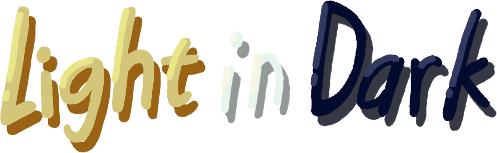

    
    

本模组与Among Us或Innersloth LLC均无关联，其内容亦未获得Innersloth LLC的认可或赞助。本模组包含的部分素材归Innersloth LLC所有© Innersloth LLC
  

This mod is not affiliated with Among Us or Innersloth LLC, and the content contained therein is not endorsed or otherwise sponsored by Innersloth LLC. Portions of the materials contained herein are property of Innersloth LLC. © Innersloth LLC.

本MODはAmong UsおよびInnersloth LLCとは一切関係がありません。また、本MODの内容はInnersloth LLCの承認または後援を得たものではありません。本MODに含まれる一部の素材はInnersloth LLCの財産です。© Innersloth LLC

# Light In Dark

**※ご注意：本MODはAIを用いて開発支援を行っている。**  
**※ご注意：本MODはAIを用いて開発支援を行っている。**  
**※ご注意：本MODはAIを用いて開発支援を行っている。**  
※ 本項目はMoon-Scarスタジオに属します。

## MODプロフィール
- 本項目はゲームAmong Usの **All-Client**（全クライアント）MODであり、ゲームの最適化、多くの職業、多くの機能などを追加するものです。  

## Bug報告 & 貢献について

もしBugを発見した場合、または提案があれば、本リポジトリの <a href="https://github.com/AfishMW/LightInDark/issues/new/choose">Issue</a> ページからご提出ください。

または電子メールを<b>hvtXsvc@Outlook.com</b>に送ることができます。また、提案の概念図やバグ再現手順、ログなどを添付してください

---

## 貢献者

### 以下の開発者の皆様のLight In Darkへの貢献に感謝いたします

開発者

絵師

- 絵師がGitHubに登録していません。お力添えをお願いします。

### 参照元

**※ 順不同**
- [FinalSuspect](https://github.com/Slok7565/FinalSuspect) サーバー選択ドロップダウンのレイアウト変更と背景画像の差し替えを参考にしました。
- [Nebula on The Ship](https://github.com/Dolly1016/Nebula) APIのUtil部分やRole登録の多くはNoSを基にしています。
- [AUnlocker](https://github.com/astra1dev/AUnlocker) コスメのアンロック機能や会議中タスクパネル表示機能は、このプロジェクトを参考にしました。 
- [TownofNext-Edited](https://github.com/qin-qwq/TownofNext-Edited) テキストボックス上部のlimit文字の変更方法、およびチャットボックスでのコピー・ペースト・全選択機能はこちらを参考にしました。  
- [Reactor](https://github.com/NuclearPowered/Reactor) カスタムRPCの正しい登録方法は、このプロジェクトから学びました。
- [MiraAPI](https://github.com/All-Of-Us-Mods/MiraAPI) Role登録の一部についてもこちらを参考にしました。
### 公式コミュニティ
- [Discord](https://discord.gg/E6KjzMEJ3) | [QQ群](https://qm.qq.com/q/qQ6xvhECWI)  
  

